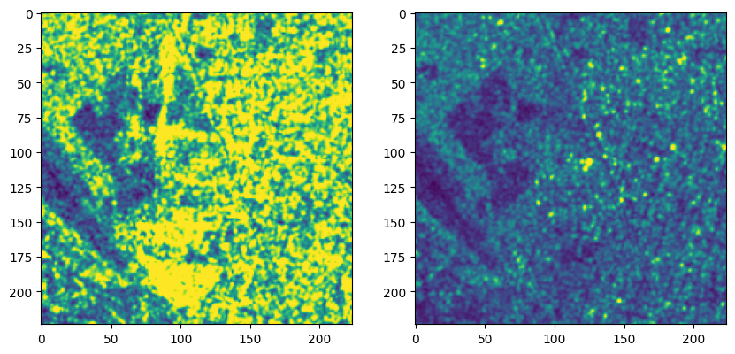
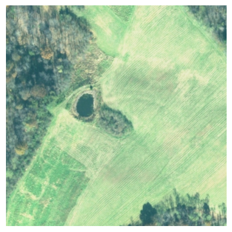

# [DOFA](https://github.com/ShadowXZT/DOFA-pytorch)
## Dynamic One-For-All foundation model for Earth vision
**What is DOFA**: DOFA is a unified multimodal foundation model for different data modalities in remote sensing and Earth observation.
<p align="center">

</p>

**Differences with existing foundation models**: DOFA is pre-trained using five different data modalities in remote sensing and Earth observation. It can handle images with any number of input channels.

**DOFA is inspired by neuroplasticity** Neuroplasticity is an
important brain mechanism for adjusting to new experiences or environmental shifts. Inspired by this concept, we design DOFA to emulate this mechanism for processing multimodal EO data.

<p align="center">

</p>

Please refer to the paper [Neural Plasticity-Inspired Foundation Model for Observing the Earth Crossing Modalities](https://arxiv.org/abs/2403.15356) for more details.


## Why develop DOFA
- The learned multimodal representation may not effectively capture such an intersensor relationship.

- The performance of foundation models will degrade when downstream tasks require the utilization of data from unseen sensors with varying numbers of spectral bands and spatial resolutions or different wavelength regimes.

- The development of individual, customized foundation models requires considerably more computing resources and human efforts.

- The increasing number of specialized foundation models makes it difficult to select the most appropriate one for a specific downstream task.

## Installation

### Requirements

The requirements of DOFA can be installed as follows:

```console
> pip install -r requirements.txt
```

### Weights

Pre-trained model weights can be downloaded from [HuggingFace](https://huggingface.co/XShadow/DOFA).

## Usage

Please refer to [demo.ipynb](https://github.com/ShadowXZT/DOFA-pytorch/blob/master/demo.ipynb) for more details.

DOFA supports input images with any number of channels using our pre-trained foundation models. The following examples show how to use DOFA for **Sentinel-1 (SAR)**, **Sentinel-2**, **NAIP RGB**. We will add example usage for Gaofen Multispectral, and Hyperspectral data soon.

### Preprare for the data loading and preprocessing

```python
# Step 1: Data preprocessing (normalization and resize)

import torch
import rasterio
import kornia as K
import numpy as np
# vh,vv
S1_MEAN = [166.36275909, 88.45542715]# / 255.0
S1_STD = [64.83126309, 43.07350145]# /255.0

S2_MEAN = [114.1099739 , 114.81779093, 126.63977424,  84.33539309,
        97.84789168, 103.94461911, 101.435633  ,  72.32804172,
        56.66528851]
S2_STD = [77.84352553, 69.96844919, 67.42465279, 64.57022983, 61.72545487,
       61.34187099, 60.29744676, 47.88519516, 42.55886798]

NAIP_MEAN = [123.675, 116.28, 103.53] # ImageNet stats for now
NAIP_STD = [58.395, 57.12, 57.375] # ImageNet stats for now

Gaufen_MEAN = [123.94924583,  92.58088583,  97.28130189,  90.31526596]
Gaufen_STD = [67.34487297, 62.8271046 , 60.5856767 , 60.3946299]
```


```python
class DataAugmentation(torch.nn.Module):
    def __init__(self, mean, std):
        super().__init__()
        self.transform = torch.nn.Sequential(
            K.augmentation.RandomResizedCrop(size=(224,224), scale=(0.2,1.0)),
            K.augmentation.Normalize(mean=mean,std=std)
        )
    @torch.no_grad()
    def forward(self,x):
        x_out = self.transform(x)
        return x_out
```

### Load Sentinel-1 data with 2 channels

```python
transform = DataAugmentation(mean=S1_MEAN,std=S1_STD)

def preprocess_s1(vh_path, vv_path):
    with rasterio.open(vh_path) as f1:
        vh = f1.read()
    with rasterio.open(vv_path) as f2:
        vv = f2.read()
    s1_img = np.concatenate((vh,vv),0).astype('float32')
    s1_img = torch.from_numpy(s1_img)
    s1_img = transform(s1_img).squeeze(0)
    return s1_img
```


```python
import matplotlib.pyplot as plt
# Load Sentinel-1 images from the given example data
C = 2  # can be 2,3,4,6,9,12,13,202 or any number if you can provide the wavelengths of them

image1 = './data/s1/vv/1869_3575.png'
image2 = './data/s1/vh/1869_3575.png'
s1_img = preprocess_s1(image1,image2)

fig, ax = plt.subplots(nrows=1, ncols=C, figsize=(10, 10))

for i,row in enumerate(ax):
    row.imshow(s1_img[i])

s1_img = s1_img.view([1,2,224,224]).cuda()
```


    

    


### Load the pre-trained weights of DOFA base model


```python
from models_dwv import vit_base_patch16

check_point = torch.load('./DOFA_ViT_base_e100.pth')
vit_model = vit_base_patch16()
msg = vit_model.load_state_dict(check_point, strict=False)
# missing_keys=['fc_norm.weight', 'fc_norm.bias', 'head.weight', 'head.bias'], unexpected_keys=['mask_token', 'norm.weight', 'norm.bias', 'projector.weight', 'projector.bias']
vit_model = vit_model.cuda()
```


```python
wavelengths = [3.75, 3.75]
out_feat = vit_model.forward_features(s1_img, wave_list=wavelengths)
out_logits = vit_model.forward(s1_img, wave_list=wavelengths)
print(out_feat.shape)
print(out_logits.shape)
```


### Load Sentinel-2 data with 9 channels


```python
import glob

C = 9

transform = DataAugmentation(mean=S2_MEAN,std=S2_STD)

def preprocess_s2(img_path):
    chs = []
    s2_files = glob.glob(f"{img_path}/*/*.png")
    for path in s2_files:
        with rasterio.open(path) as f:
            ch = f.read()
        chs.append(ch)
    s2_img = np.concatenate(chs, 0).astype("float32")
    s2_img = torch.from_numpy(s2_img)
    s2_img = transform(s2_img).squeeze(0)
    return s2_img
```

Visualize the Sentinel-2 imagery


```python
s2_img = preprocess_s2("data/s2/S2A_MSIL1C_20170528T050611_N0205_R076_T44NMM_20170528T050606")
fig, ax = plt.subplots(nrows=1, ncols=C, figsize=(10, 10))

for i,row in enumerate(ax):
    row.imshow(s2_img[i])
    row.axis("off")
s2_img = s2_img.view([1,C,224,224]).cuda()
```

    /opt/miniconda3/lib/python3.11/site-packages/rasterio/__init__.py:304: NotGeoreferencedWarning: Dataset has no geotransform, gcps, or rpcs. The identity matrix will be returned.
      dataset = DatasetReader(path, driver=driver, sharing=sharing, **kwargs)


    

    


### We use the same DOFA model to inference the Sentinel-2 image


```python

wavelengths = [0.665, 0.56, 0.49, 0.705, 0.74, 0.783, 0.842, 1.61, 2.19]

out_feat = vit_model.forward_features(s2_img, wave_list=wavelengths)
out_logits = vit_model.forward(s2_img, wave_list=wavelengths)
print(out_feat.shape)
print(out_logits.shape)
```

### What if I only want to use a subset of Sentinel-2 data?


```python
# Let's only keep the first 5 channels
wavelengths = [0.665, 0.56, 0.49, 0.705, 0.74]

out_feat = vit_model.forward_features(s2_img[:,:5,...], wave_list=wavelengths)
out_logits = vit_model.forward(s2_img[:,:5,...], wave_list=wavelengths)
print(out_feat.shape)
print(out_logits.shape)
```

### Usage for RGB optical data


```python
C = 3

transform = DataAugmentation(mean=NAIP_MEAN, std=NAIP_STD)


def preprocess_rgb(img_path):
    with rasterio.open(img_path) as f:
        rgb_img = f.read().astype("float32")
    rgb_img = torch.from_numpy(rgb_img)
    rgb_img = transform(rgb_img).squeeze(0)
    return rgb_img
```


```python
import cv2

rgb_path = 'data/naip/36861_49963.png'
naip_img = preprocess_rgb(rgb_path)

plt.imshow(cv2.cvtColor(cv2.imread(rgb_path), cv2.COLOR_BGR2RGB))
plt.axis("off")

naip_img = naip_img.view([1,C,224,224]).cuda()
```


    

    


```python
wavelengths = [0.665, 0.56, 0.49]

out_feat = vit_model.forward_features(naip_img, wave_list=wavelengths)
out_logits = vit_model.forward(naip_img, wave_list=wavelengths)
print(out_feat.shape)
print(out_logits.shape)
```

Usage for Hyperspectral images is similar to other images.


### TorchGeo

Alternatively, DOFA can be used via the [TorchGeo](https://github.com/microsoft/torchgeo) library:

```python
import torch
from torchgeo.models import DOFABase16_Weights, dofa_base_patch16_224

# Example NAIP image (wavelengths in $\mu$m)
x = torch.rand(2, 4, 224, 224)
wavelengths = [0.48, 0.56, 0.64, 0.81]

# Use pre-trained model weights
model = dofa_base_patch16_224(weights=DOFABase16_Weights.DOFA_MAE)

# Make a prediction (model may need to be fine-tuned first)
y = model(x, wavelengths)
```

---

If you find the DOFA useful in your research, please kindly cite our paper:
```
@misc{xiong2024neural,
      title={Neural Plasticity-Inspired Foundation Model for Observing the Earth Crossing Modalities}, 
      author={Zhitong Xiong and Yi Wang and Fahong Zhang and Adam J. Stewart and Joëlle Hanna and Damian Borth and Ioannis Papoutsis and Bertrand Le Saux and Gustau Camps-Valls and Xiao Xiang Zhu},
      year={2024},
      eprint={2403.15356},
      archivePrefix={arXiv},
      primaryClass={cs.CV}
}
```
